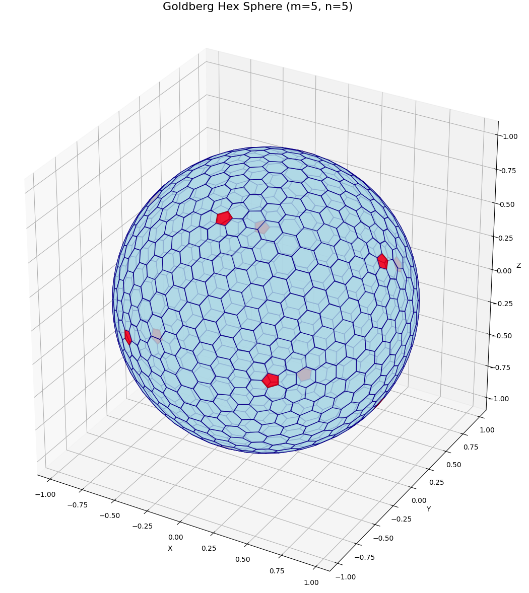

# Goldberg Hexgrid

A Python package for generating Goldberg polyhedra and working with hexagonal coordinate systems on spheres.

## Overview

This package provides utilities for:

- **Hexagonal coordinate systems**: Axial/cube coordinates for hexagonal grids
- **Goldberg polyhedron generation**: Create spherical hex grids using Goldberg polyhedra
- **3D vertex operations**: Work with vertices on unit spheres
- **Visualization**: Render hex grids in 3D and 2D projections

## Installation

```bash
pip install -e .
```

Or install from a git submodule:

```bash
# If using as a git submodule
cd goldberg-hexgrid
pip install -e .
```

## Usage

### Hex Coordinates

```python
from goldberg_hexgrid import HexCoordinates, hex_distance, hex_neighbors

# Create a hex coordinate
coord = HexCoordinates(1, 2, -3)

# Get neighbors
neighbors = hex_neighbors(coord)

# Calculate distance
distance = hex_distance(coord, HexCoordinates(0, 0, 0))
```

### Goldberg Polyhedron Generation

```python
from goldberg_hexgrid import generate_goldberg_hex_sphere

# Generate a Goldberg polyhedron with parameters m=5, n=5
hex_coords, positions, neighbors_map = generate_goldberg_hex_sphere(m=5, n=5)

# hex_coords: List of HexCoordinates for each tile
# positions: List of Vertex3D positions on the unit sphere
# neighbors_map: Dictionary mapping tile index to neighbor indices
```

### Vertex Operations

```python
from goldberg_hexgrid import Vertex3D

# Create and normalize a vertex
v1 = Vertex3D(1.0, 2.0, 3.0).normalize()

# Calculate distance
v2 = Vertex3D(0.0, 0.0, 1.0)
distance = v1.distance_to(v2)

# Dot and cross products
dot = v1.dot(v2)
cross = v1.cross(v2)
```

### Visualization and Rendering

The package includes rendering utilities to visualize generated hex grids. Install the visualization dependencies:

```bash
pip install -e ".[viz]"
```

Or for Jupyter notebook support with interactive 3D plots:

```bash
pip install -e ".[notebooks]"
```

#### 3D Rendering

```python
from goldberg_hexgrid import generate_goldberg_hex_sphere
from goldberg_hexgrid.rendering import render_hex_grid_3d, render_hex_grid_interactive
import matplotlib.pyplot as plt

# Generate a hex grid
hex_coords, positions, neighbors_map = generate_goldberg_hex_sphere(m=5, n=5)

# Render in 3D (interactive in Jupyter notebooks with ipympl)
fig, ax = render_hex_grid_interactive(
    positions,
    neighbors_map,
    figsize=(14, 14),
    alpha=0.8,
    face_color="lightblue",
    edge_color="navy",
)

plt.title("Goldberg Hex Sphere (m=5, n=5)")
plt.show()
```

**Example output (m=5, n=5):**



The rendering automatically detects and colors pentagons (5 neighbors) in red, while hexagons (6 neighbors) use the specified colors.

#### 2D Map Projections

```python
from goldberg_hexgrid.rendering import render_hex_grid_2d_projection

# Render as 2D map projection (Mollweide projection)
fig, ax = render_hex_grid_2d_projection(
    positions,
    neighbors_map,
    projection="mollweide",
    figsize=(16, 8),
    alpha=0.7,
    face_color="lightgreen",
    edge_color="darkgreen",
)

plt.show()
```

#### Jupyter Notebooks

See the `notebooks/render_hexgrid.ipynb` notebook for complete examples including:
- Interactive 3D rendering
- Multiple viewing angles
- 2D map projections
- Different grid sizes

**Note:** For interactive 3D plots in Jupyter, use `%matplotlib ipympl` at the beginning of your notebook.

## Development

### Setup

```bash
# Install in development mode
pip install -e ".[dev]"

# Run linting
ruff check .

# Run type checking
mypy goldberg_hexgrid
```

## License

MIT License

## Credits

Based on the Goldberg Polyhedron implementation from:
https://github.com/shwuandwing/Goldberg-Polyhedron-Earth

Rewritten in Python from the TypeScript implementation.
